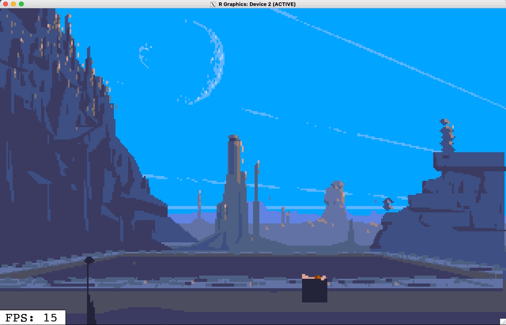
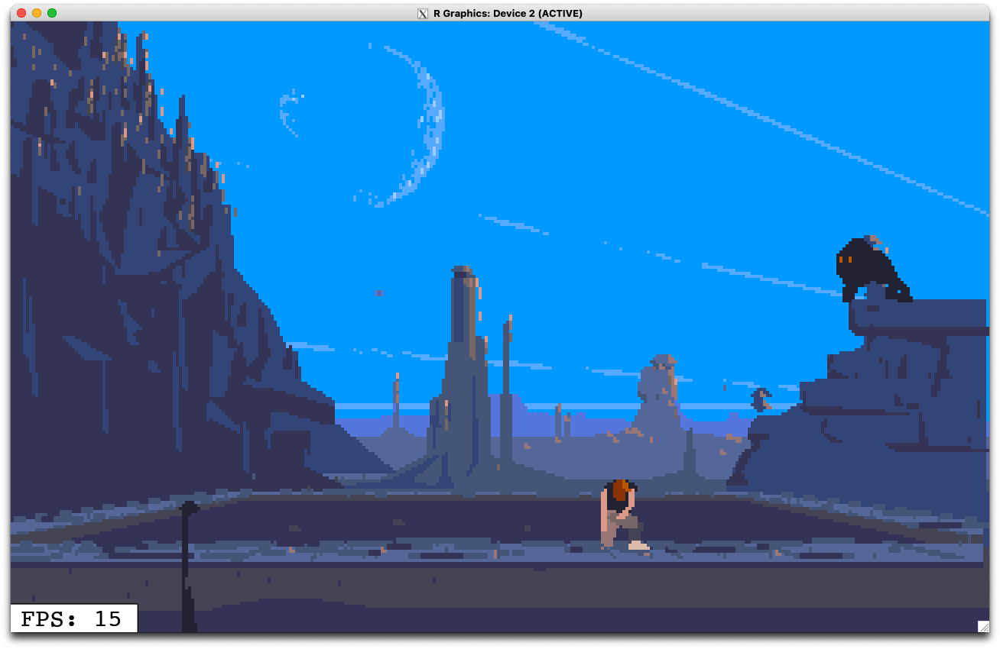
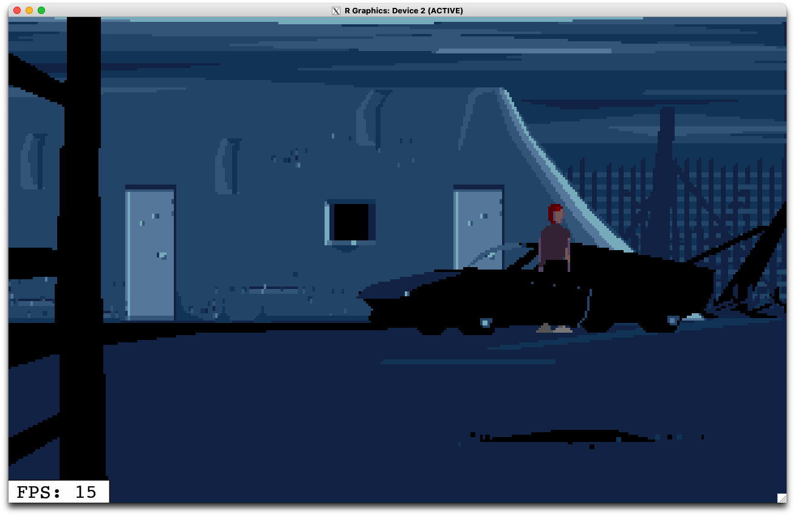
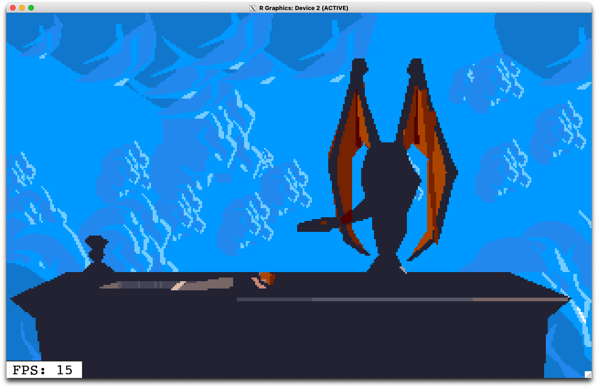
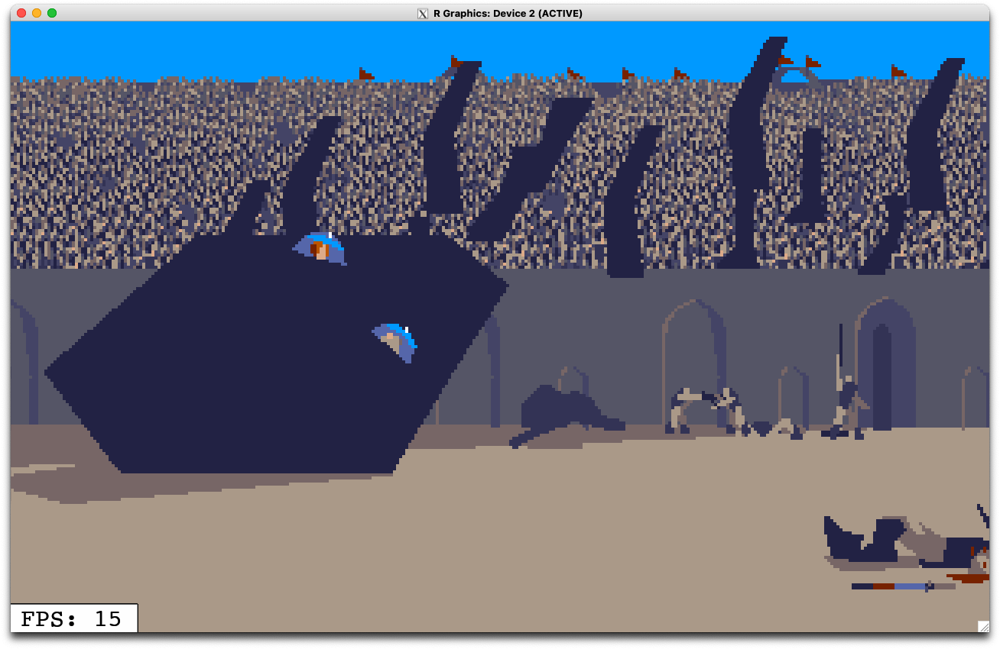

# `AnotherWorld` playable game in R

This is the full code for a playable R version of the 16-bit game [`AnotherWorld`](https://en.wikipedia.org/wiki/Another_World_(video_game))

The game plays in realtime using 2 key packages:

* [`{nara}`](https://github.com/coolbutuseless/nara) for manipulation of
  *nativeRaster* images as a fast in-memory drawing canvas
* [`{eventloop}`](https://github.com/coolbutuseless/eventloop) for event-driven
  interaction - allowing for keyboard feedback while rendering the game with
  sound.

### Warning: Game not yet finished!

I have not finished porting this game to R.  The code is still being worked on.  

Please forgive me for any glitches you find!  

Or file an issue on github if you think something is definitely wrong!


## Gameplay in R

A live capture of playing the game in R


  


## Installation


1. Install the dependencies
    * [`{nara}`](https://github.com/coolbutuseless/nara)
    * [`{eventloop}`](https://github.com/coolbutuseless/eventloop)
2. Retrieve the anotherworld game code from [github](https://github.com/coolbutless/anotherworld)
    * Note that this is *not* a package, but just a collection of R scripts and
      code.  This should make it easier to hack on, extend and adapt.


```
library(remotes)

# Install dependencies
remotes::install_github('coolbutuseless/eventloop')
remotes::install_github('coolbutuseless/nara')

# Install packages
install.packages('audio')

# Grab a copy of the code (this is not distributed as a package)
system("git clone https://github.com/coolbutuseless/anotherworld")
setwd('anotherworld')
```


## Play the game

* **16001** "Introduction": cinematic introduction. No user interactivity
* **16002** "Water": If you want to get to playing the game, this is the section to run.
    * Hint: Press "Up" at the start when it looks like you're underwater.
* **16003** "Jail"
* **16004** "City"
* **16005** "Arena"
* **16006** "Luxe"
* **16007** "Final"


```
PART <- 16002  # <------- select the part of the game to play
source('game.R')
```


## GamePlay 

#### Game walkthrough on the Amiga

This looks pretty similar to the R version as it's running on the same
in-game virtual machine. 

Click the image below to watch it on youtube.

[](https://www.youtube.com/watch?v=utrxk5_PeEY)


#### Screenshots of the R version

<div>
  <div style="float: left; width: 45%;"></div>
  <div style="float: left; width: 45%;"></div>
</div>

<div>
  <div style="float: left; width: 45%;"></div>
  <div style="float: left; width: 45%;"></div>
</div>


## Controls

After your experiment on earth goes awry, you are transported to *another world*
where you must survive and, hopefully, escape!

* Run game with `source('game.R')`
    * Set `PART` variable first to the section you want to play.
* Control game with arrow keys and space bar (for action)
* Press 'p' to pause
* Press 'ESC' to quit
* When you finish a section the game does not automatically advance to the next
  section. 
  
  
  

## ToDo

* Audio not yet working on Unix. Help needed. What's a good command line 
  audio playback utility that everyone can install easily?
* Controls still feel a bit "sticky".  This feels like a bug in my code.
* Incorporate display of pre-rendered bitmaps which are part of the in-game data
    * You'll notice some scenes are a little blank because these bitmaps 
      aren't drawn yet.
* Still some rendering anomalies
* See if I can get sound playback with `{audio}` package working correctly
* While there are sound effects in the R version, there is currently no music.


## Requirements

**macOS**

Running this on macOS requires [XQuartz](https://www.xquartz.org/) to have been 
installed in order to support the `x11()` device.
  
**Linux**

R needs to have been compiled with `x11()` and Cairo support.
  
  
## Limitation - WindowsOS

The WindowsOS version of R does not currently have support for the `onIdle` callback and 
therefore does not support  event-driven interactive graphics as implemented 
in the `{eventloop}` package.

**If you are a windows developer capable of adding support for an `onIdle` callback
to R itself, please get in touch!**

## Limitation - Flickering Cursor

The cursor icon in an `{eventloop}` window will flicker because of some hard-coded
behaviour in R's double-buffered `x11()` graphics device.

`{eventloop}` makes use of the `x11()` graphics device with a double-buffered
backend based on Cairo  (`x11(type = 'dbcairo')`).

The double-buffering within the graphics device is coordinated through use
of `dev.hold()` and `dev.flush()` calls.

Whenever `dev.hold()` is called, the cursor will be set to the busy cursor
(usually a stopwatch on macOS), and when `dev.flush()` is called the 
cursor reverts to a normal pointer arrow.

Since `dev.hold()` and `dev.flush()` are called when drawing every single 
frame, the cursor will flicker between these two images.

The interim solution is to not have the cursor over the window when interacting
with the app.  This only really works when the app solely relies on keyboard
feedback (like this game of AnotherWorld).

The more complicated solution will involve crafting a patch to R itself to
make the cursor change behaviour user-configurable rather than hard-coded.

**If you are are an R developer capable of crafting such a patch to R ,
please get in touch with me!**

## Reference Source Code

The reference code for this port was the JavaScript code from [github/cyxx/another_js](https://github.com/cyxx/another_js).

Further details have been extracted from the C code from [Fabien's C++ Interpreter](https://github.com/fabiensanglard/Another-World-Bytecode-Interpreter).

## Challenges


###  0-based vs 1-based indexing

Javascript and C code used for reference both use 0-based indexing, whereas R 
uses 1-based indexing.

To try and avoid editing all references to array indexint to `+1`, I created
a new class `cindex` which has 1-based indexing in R.

There still a lot of refacoring to do, and many structures are still indexed 
by a character string representation of the hexadecimal version of the 
index or address i.e. ugly.


### bitwise operations

JS and C both use `&` and `|` for bitwise operations, whereas R uses them 
for logical operations.

I created a set of infix operators (`%|%` etc) to mimic the bitwise operators 
in C.

### 'Bytekiller' compression

Data in the original game is compressed with 'bytekiller' which is a very very 
old skool data compression algorithm.

